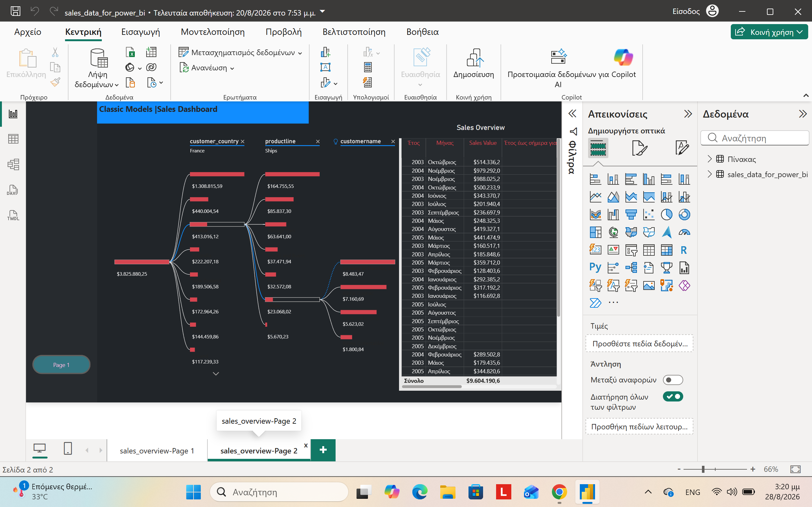
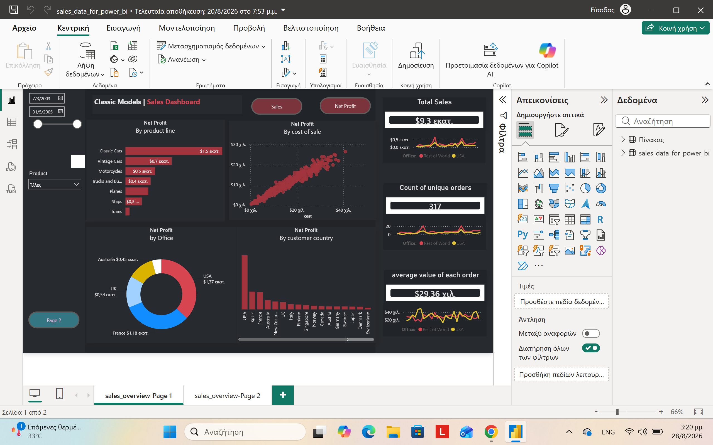

# Classic Models Sales & Profitability Dashboard

An end-to-end data analysis project: from raw sales data in SQL, through exploratory analysis in Excel, to a full interactive Power BI dashboard. Built on the Classic Models dataset, it answers real business questions — which markets and products drive the most profit, and how customer purchasing behavior changes over time.

## About this project

This is a data analysis project using the Classic Models database — a sample dataset for a company that sells model cars, planes, ships and other vehicles to customers worldwide.

I wanted to practice a full workflow: start with raw data in SQL, explore it in Excel, and then build an interactive dashboard in Power BI. The goal was to answer some basic business questions — which countries and product lines make the most profit, how customer orders change over time, and which products tend to get bought together.

## Tools used

- **SQL (MySQL Workbench)** – for querying and preparing the data
- **Excel** – pivot tables to explore the data before building the dashboard
- **Power BI** – for the final interactive dashboard

## Workflow

MySQL → Excel → Power BI

## 1. SQL

The raw data is spread across several tables (orders, order details, customers, products, employees, offices), so the first step was joining them together.

I created a view called `sales_data_for_power_bi` that joins all the relevant tables and calculates `sales_value` and `cost_of_sales`. This view is what Power BI connects to.

I also wrote a few extra queries to look at specific things:
- **Customer purchase trends** – using `ROW_NUMBER()` and `LAG()` to see how each customer's order value changes over time
- **Credit limit segmentation** – using `CASE` to group customers by credit limit and compare their sales
- **Products bought together** – a self-join to find which product lines are often ordered together
- **Sales by location** – joining across all the main tables to compare sales by customer country, city, and office

All queries are in [`classic models analysis.sql`](classic%20models%20analysis.sql), with comments explaining what each one does.

## 2. Excel

Before building anything in Power BI, I exported the SQL results into Excel and built pivot tables to get a first look at the data. This helped me decide what was actually worth putting on the dashboard.

- `Classic_Models_Analysis.xlsx` – pivot tables for sales/profit by product, by country, by credit limit group, by office, and purchase value change per customer
- `products_purchased_together.xlsx` – a pivot table showing how often product lines are bought together

## 3. Power BI Dashboard

The dashboard has two pages.

**Page 1** has a decomposition tree so you can drill down from customer country → product line → customer name, plus a table of sales by year and month.

**Page 2** is more of a KPI overview: total sales, net profit, number of orders, average order value, and breakdowns by product line, office, and customer country. There's also a scatter chart comparing profit to cost.

Both pages share two buttons — Sales and Net Profit — that switch what all the charts are showing. I used bookmarks to set this up, and the chart titles change automatically depending on which one is selected.

I also added Month-over-Month % and Year-to-Date calculations to the sales table, and filters for date range and product.

## Key numbers

- Total Sales: $9.3M
- 317 unique orders, average order value $29.36K
- Top country by profit: USA ($1.37M), then France ($1.18M)
- Top product line by profit: Classic Cars ($1.5M)

## What I noticed

- The USA is the strongest market by far — highest sales and profit
- Classic Cars is the most profitable product line
- Sales and profit differ a lot between countries, products and customers, so there's room for more targeted decisions
- Looking at the MoM and YTD numbers, sales go up and down through the year — some months are clearly stronger than others
- A small group of customers and products bring in a lot more revenue than the rest

## What the company could do with this

1. **Put more effort into strong markets** — more marketing and sales focus on the USA and other high-performing countries
2. **Keep pushing the profitable lines** — make sure Classic Cars stays well-stocked and promoted
3. **Look after the best customers** — the highest-revenue customers are worth keeping happy with offers or loyalty perks
4. **Check the weaker products/markets** — figure out if it's pricing, cost, or demand holding them back
5. **Keep an eye on MoM/YTD** — the dashboard makes it easy to spot changes early and react faster

## Conclusion

This project shows how raw sales data can turn into something actually useful for a business. Going through SQL, Excel and Power BI made it possible to see clearly which markets, products and customers matter most — the kind of thing that helps with real decisions about sales, marketing and where to focus.

## Dashboard screenshots

### Page 1

### Page 2

## What's in this repo

- `classic models analysis.sql` – all SQL queries
- `Classic_Models_Analysis.xlsx`, `products_purchased_together.xlsx` – pivot table workbooks
- `page1_sales_overview.png`, `page2_kpi_dashboard.png` – dashboard screenshots
- `sales_data_for_power_bi.pbix` – the Power BI file (needs Power BI Desktop to open)

## Notes

I built this while doing a Udemy Data Analysis course, using it as a way to practice going from raw data all the way to a finished dashboard.
